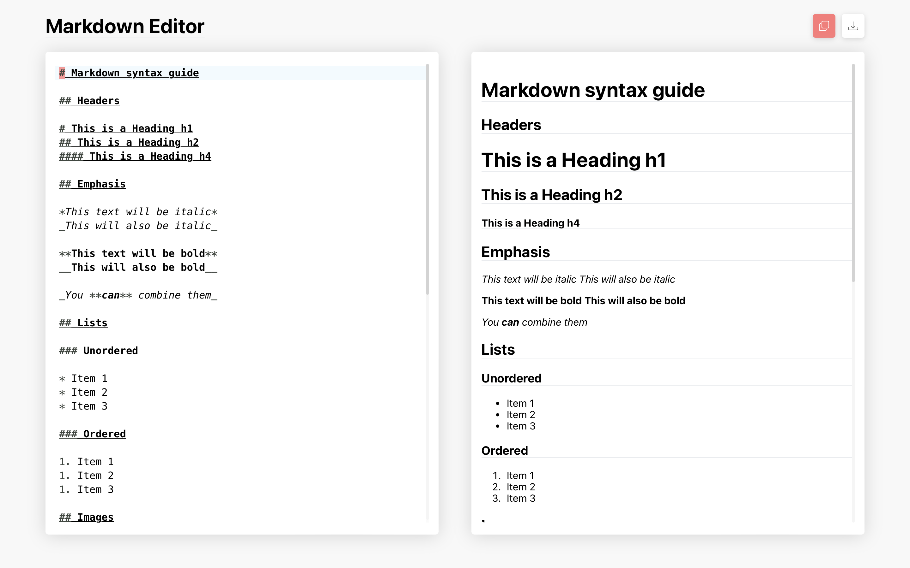

# Markdown Editor

A minimalist markdown editor with a core set of features. For a list of features included, refer to the [features](./#features) section of the README.

## Features

- Minimal
- Live Preview
- Synced scrolling
- Vim mode
- Download
- Copy to clipboard
- Toast notifications

## Todos

- [x] Vim mode
- [x] Copy to clipboard
- [ ] LocalStorage integration
- [ ] Markdown syntax guide
